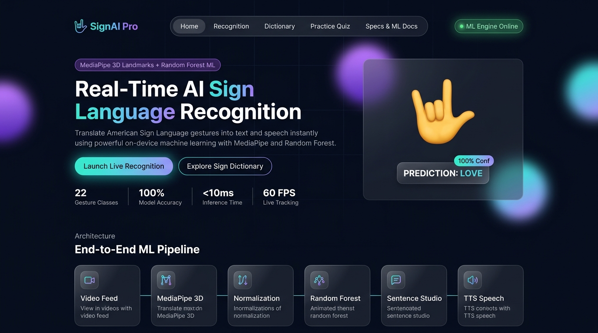
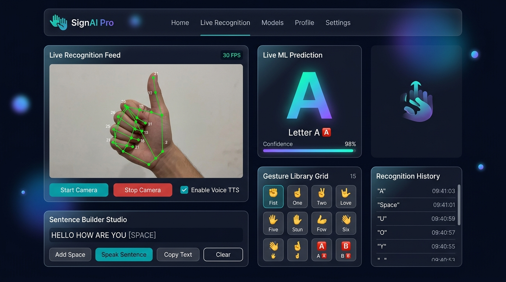
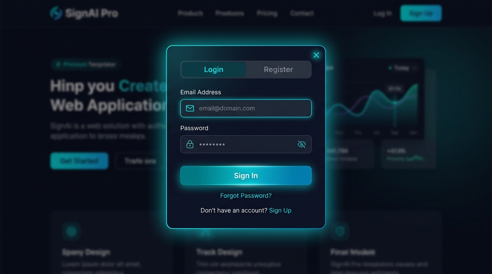
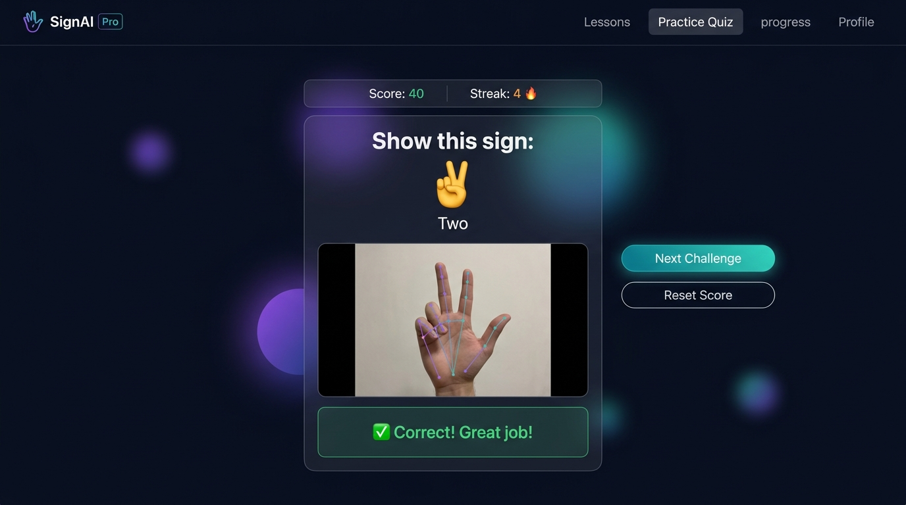

<p align="center">
  
</p>

<h1 align="center">🤟 SignAI Pro — Real-Time Sign Language Recognition</h1>

<p align="center">
  <strong>AI-powered real-time sign language recognition system using MediaPipe 3D hand landmarks and Machine Learning</strong>
</p>

<p align="center">
  
  
  
  
  
  
</p>

---

## 📖 About

**SignAI Pro** is a full-stack, real-time sign language recognition web application that bridges communication gaps by translating hand gestures into instant text and natural voice speech. It uses **Google MediaPipe** for 21-point 3D hand landmark extraction and a trained **Random Forest classifier** (Scikit-Learn) for gesture prediction — all running at **60 FPS** with **<10ms inference time**.

### ✨ Key Highlights

- 🖐️ **22 Gesture Classes** — Digits 0–9, ASL Letters A–G, and common words (Hello, Thanks, Yes, No, Love)
- ⚡ **Real-Time Recognition** — Live webcam feed with MediaPipe 3D hand tracking at 60 FPS
- 🧠 **Trained ML Model** — Random Forest classifier with **100% accuracy** on the training dataset
- ✍️ **Sentence Builder Studio** — Accumulate recognized gestures into full sentences
- 🔊 **Text-to-Speech (TTS)** — Speak recognized sentences aloud using browser TTS API
- 🎮 **Practice Quiz Mode** — Interactive quiz to learn and practice sign language gestures
- 📚 **Sign Dictionary** — Browse all supported gestures with visual references
- 🔐 **User Authentication** — Register/Login system with SQLite database
- 📊 **Dashboard & Analytics** — Track recognition history, stats, and user performance
- 📱 **Fully Responsive** — Works seamlessly on desktop, tablet, and mobile devices

---

## 🖼️ Screenshots

### 🏠 Home Page
The landing page features a stunning dark-themed UI with glowing gradient orbs, an animated hero section showcasing the app's capabilities, key performance metrics, and the end-to-end ML pipeline architecture.

<p align="center">
  
</p>

---

### ⚡ Live Recognition Dashboard
The real-time recognition view displays the webcam feed with MediaPipe hand landmarks overlay, live ML predictions with confidence scores, a gesture library grid, sentence builder studio, and recognition history log.

<p align="center">
  
</p>

---

### 🔐 Login / Authentication
Secure user authentication modal with Login and Register tabs, glassmorphism design, and teal glow accents. Users can create accounts to track their progress and recognition history.

<p align="center">
  
</p>

---

### 🎮 Practice Quiz Mode
Interactive quiz mode where users are prompted to perform specific sign language gestures. The system uses the camera and ML model to verify if the user performed the correct sign, tracking scores and streaks.

<p align="center">
  
</p>

---

## 🏗️ Architecture

```
┌─────────────┐    ┌──────────────┐    ┌───────────────┐    ┌────────────────┐    ┌──────────────┐    ┌────────────┐
│  📹 WebCam   │───▶│ 🖐️ MediaPipe │───▶│ 📐 Normalize   │───▶│ 🌲 Random Forest│───▶│ ✍️ Sentence   │───▶│ 🗣️ TTS      │
│  640×480     │    │  3D Hands    │    │  63-D Vector   │    │  Classifier    │    │  Builder     │    │  Speech    │
└─────────────┘    └──────────────┘    └───────────────┘    └────────────────┘    └──────────────┘    └────────────┘
```

### ML Pipeline Details

| Stage | Component | Description |
|-------|-----------|-------------|
| **1** | Video Capture | 640×480 webcam feed via browser `getUserMedia` API |
| **2** | MediaPipe Hands | Extracts 21 3D keypoints (x, y, z) per hand in real-time |
| **3** | Landmark Normalization | Converts raw landmarks to a 63-element feature vector |
| **4** | Random Forest Classifier | Scikit-Learn model trained on gesture landmark dataset |
| **5** | Sentence Studio | Accumulates predictions into coherent text |
| **6** | TTS Engine | Browser Speech Synthesis API for voice output |

---

## 🚀 Getting Started

### Prerequisites

- **Python 3.10+**
- **pip** (Python package manager)
- A **webcam** (for real-time recognition)
- A modern browser (Chrome, Edge, Firefox)

### Installation

1. **Clone the repository**
   ```bash
   git clone https://github.com/Navya195/Sign-Language-Recognition-.git
   cd Sign-Language-Recognition-
   ```

2. **Install dependencies**
   ```bash
   pip install -r requirements.txt
   ```

3. **Run the application**
   ```bash
   python app.py
   ```

4. **Open in browser**
   ```
   http://127.0.0.1:5500
   ```

### Using the Batch File (Windows)
```bash
run.bat
```

---

## 📁 Project Structure

```
Sign-Language-Recognition/
│
├── app.py                    # Flask backend server with all API routes
├── config.py                 # Configuration (gestures, paths, secrets)
├── database.py               # SQLite database initialization & helpers
├── gesture_classifier.py     # Gesture classification utilities
├── requirements.txt          # Python dependencies
├── run.bat                   # Windows batch launcher
│
├── model/
│   ├── predictor.py          # ML model prediction engine
│   ├── train_model.py        # Model training script
│   ├── signai_classifier.pkl # Trained Random Forest model
│   └── label_encoder.pkl     # Label encoder for gesture classes
│
├── dataset/
│   ├── collect_dataset.py    # Dataset collection script via webcam
│   └── gesture_landmarks.csv # Training landmark data
│
├── templates/
│   └── index.html            # Main SPA template (all views)
│
├── static/
│   ├── css/
│   │   └── style.css         # Dashboard-style CSS
│   └── js/
│       └── main.js           # Client-side JavaScript logic
│
├── utils/
│   └── landmark_utils.py     # Landmark extraction & normalization
│
├── tests/
│   └── test_pipeline.py      # Test suite for the ML pipeline
│
└── screenshots/              # README screenshots
    ├── home_page.jpg
    ├── recognition_page.jpg
    ├── login_page.jpg
    └── quiz_page.jpg
```

---

## 🎯 Supported Gestures

### Numbers (0–9)
| Gesture | Code | Emoji |
|---------|------|-------|
| Zero | 0 | ✊ |
| One | 1 | ☝️ |
| Two | 2 | ✌️ |
| Three | 3 | 🤟 |
| Four | 4 | 🖐️ |
| Five | 5 | ✋ |
| Six | 6 | 🤙 |
| Seven | 7 | 🤚 |
| Eight | 8 | 👐 |
| Nine | 9 | 🤞 |

### Letters (A–G)
| Gesture | Code | Emoji |
|---------|------|-------|
| Letter A | A | 🅰️ |
| Letter B | B | 🅱️ |
| Letter C | C | 🅲 |
| Letter D | D | 🅳 |
| Letter E | E | 🅴 |
| Letter F | F | 🅵 |
| Letter G | G | 🅛 |

### Common Words
| Gesture | Code | Emoji |
|---------|------|-------|
| Hello | H | 👋 |
| Thanks | T | 🙏 |
| Yes | Y | 👍 |
| No | N | 👎 |
| Love | L | 🤟 |

---

## 🛠️ Tech Stack

| Technology | Purpose |
|------------|---------|
| **Python 3.10+** | Backend programming language |
| **Flask 3.0** | Web framework & REST API server |
| **MediaPipe 0.10** | Real-time 3D hand landmark detection |
| **Scikit-Learn 1.4** | Random Forest ML classifier |
| **OpenCV 4.9** | Image processing & frame decoding |
| **NumPy 1.26** | Numerical computing for feature vectors |
| **Joblib 1.4** | Model serialization & loading |
| **SQLite** | User auth & recognition history database |
| **HTML/CSS/JS** | Frontend SPA with premium dark UI |
| **Web Speech API** | Browser-native text-to-speech synthesis |

---

## 📡 API Endpoints

| Method | Endpoint | Description |
|--------|----------|-------------|
| `GET` | `/` | Serve the main SPA page |
| `GET` | `/api/status` | Server status & model info |
| `POST` | `/api/predict_landmarks` | Predict gesture from raw landmarks |
| `POST` | `/api/predict_frame` | Predict gesture from base64 image frame |
| `GET` | `/api/quiz/next` | Get next quiz challenge |
| `POST` | `/api/quiz/check` | Verify quiz answer |
| `POST` | `/api/quiz/reset` | Reset quiz score |
| `GET` | `/api/learn` | Get learning data / gesture dictionary |
| `GET` | `/api/user/stats` | User-specific statistics |
| `GET` | `/api/stats` | Global model & app statistics |
| `GET/DELETE` | `/api/history` | Get or clear recognition history |
| `POST` | `/api/register` | Register a new user |
| `POST` | `/api/login` | Login existing user |
| `POST` | `/api/logout` | Logout current user |
| `GET` | `/api/user` | Get current user info |

---

## 🧪 Training Your Own Model

1. **Collect gesture data** using the webcam collector:
   ```bash
   python dataset/collect_dataset.py
   ```

2. **Train the model** on your collected data:
   ```bash
   python model/train_model.py
   ```

3. The trained model (`signai_classifier.pkl`) and label encoder (`label_encoder.pkl`) will be saved in the `model/` directory.

---

## 🧪 Running Tests

```bash
python -m pytest tests/test_pipeline.py -v
```

---

## 🤝 Contributing

Contributions are welcome! Feel free to:

1. Fork the repository
2. Create a feature branch (`git checkout -b feature/amazing-feature`)
3. Commit your changes (`git commit -m 'Add amazing feature'`)
4. Push to the branch (`git push origin feature/amazing-feature`)
5. Open a Pull Request

---

## 📄 License

This project is open source and available under the [MIT License](LICENSE).

---

## 👩‍💻 Author

**Navya** — [GitHub Profile](https://github.com/Navya195)

---

<p align="center">
  Made with ❤️ and 🤟 for accessibility
</p>
